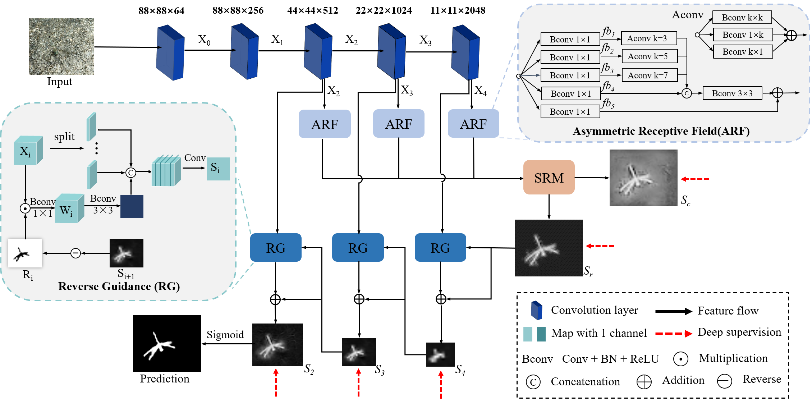

# Camouflaged insect segmentation using a progressive refinement network

> **Authors:** 
> [Jing Wang*](https://abigale666.github.io/wangjing_homepage.github.io/), 
> [Minglin Hong*](https://hongminglin08.github.io/index-en.html), 
> [Xia Hu*](https://lxy.fafu.edu.cn/37/85/c6857a145285/page.htm),
> [Xiaolin Li](https://orcid.org/0000-0002-0997-2776),
> [Shiguo Huang](https://xxxy.fafu.edu.cn/2017/0604/c7843a183612/page.psp),
> [Rong Wang](https://lxy.fafu.edu.cn/38/8d/c6857a145549/page.psp), and 
> [Feiping Zhang](https://lxy.fafu.edu.cn/37/7c/c6857a145276/page.psp).

## 1. Preface

- This repository provides the source code for "_**Camouflaged insect segmentation using progressive refinement network**_". 

- If you have any questions about our paper, feel free to contact Jing Wang <wangjingsay@gmail.com>
or Mingling Hong <minglinhong08@gmail.com> via E-mail. And if you are using PRNet for your research, please cite it.

<!-- 
## 1. Overview

### 1.1. Introduction
Accurately segmenting the insect from its original ecological image is the core technology restricting the accuracy and efficiency of automatic recognition. However, the performance of existing segmentation methods is unsatisfactory in insect images shot in wild backgrounds with several challenges: various sizes, similar colours or textures to the surroundings, transparent body parts and vague outlines.

      
    <em> 
    Figure 1: Salient insects and camouflaged insects.
    </em>

These challenges of image segmentation are accentuated when dealing with camouflaged insects. Here, we developed an insect image segmentation method based on deep learning termed progressive refinement network (PRNet), especially for camouflaged insects. Unlike existing insect segmentation methods. PRNet captures the possible scale and location of insects by extracting the contextual information of the image, and fuses comprehensive features to suppress distractors, thereby clearly segmenting insect outlines.

Experimental results based on 1900 camouflaged insect images demonstrated PRNet could effectively segment the camouflaged insects and achieved a superior detection performance, with the mean absolute error of 3.2\%, pixel matching degree of 89.7\%, structural similarity of 83.6\%, and precision and recall error of 72\%, which achieved the improvement of 8.1\%, 25.9\%, 19.5\%, and 35.8\%, respectively, when compared to the recent salient object detection methods.

### 1.2. Method
A particularly successful deep learning  technology when it comes to image processing is the end-to-end network model, which takes images as inputs, and directly outputs the prediction results, without requiring any hand-crafted prepossessing. This study deployed an end-to-end Progressive refinement network (PRNet). 

      
    <em> 
    Figure 2: Overview of the proposed PRNet, which consists of Asymmetric Receptive Field, Self-Refinement Module, and Reverse Guidance Based Decoder. See § 2 in the paper for details.
    </em>

As the framework shown in Figure 2, it was built on an encoder-decoder architecture. Encoder mapped the input images into eigenvectors, and the decoder utilized the eigenvectors to decode the structural information about the images and output the prediction results. Notably, insects might appear with different sizes in images, thus for the encoder, the Res2Net-based backbone network, which inherited the advantages of ResNet-50 but has a stronger ability to extract multi-scale semantic features, was utilized to extract multi-level features. In specific, we designed five extractors, and each of them contains several network layers based on a Res2Net-based network. We called the first two extractors low-level extractor and the others high-level extractor, which extract low-level features $\{X_0, X_1\}$, and high-level features $\{X_2, X_3, X_4\}$, respectively. It was proved that the low-level features demanded more computational resources due to their larger spatial resolutions, but contribute less to performance . Motivated by this, our model concentrated more on high-level features rather than all features. After the encoder extracted features from insect images, the corresponding scale features from high-levels would be fed into ARF modules which aimed to extract anisotropy contextual information in the horizontal, vertical and square kernel modes from high-level features. Furthermore, a novel SRM with an initial attention strategy, aggregated the coarse information from the output of the ARF modules to generate a probable camouflage mask with coarse object region and an enhanced coarse mask. After that, this enhanced mask gradually sharpened by sequentially fusing with previous maps in the top-down decoding process. Each module proposed in this study was described as follows.

#### 1.2.1 Asymmetric Receptive Field

Since camouflaged insects often come from natural scenes, their sizes are varied and stochastic. To handle this challenge, multiple receptive fields are widely used in object detection, which contain square kernels of different sizes (such as $k\times k$ convolutional layer with dilation rate $d$) to obtain multi-scale representation. However, such square convolutions restrict the capture of the anisotropy context existing widely in real scenes . In addition, since the camouflaged insects have similar characteristics to the surrounding environment, the standard convolutional layers with square kernels can easily introduce noise interference from the background. Therefore, the convolutions with square kernels are not applicable to camouflaged insect segmentation. 

The Asymmetric Convolution block that comprises three parallel layers with $k\times k$, $1\times k$ and $k\times 1$ kernels is used to enhance the robustness of a model to rotation and learn more important information of images. As the $1\times k$ and $k\times 1$ layers have non-square kernels, they are referred as the asymmetric convolutional layers. Inspired by this, we proposed an Asymmetric Receptive Field (ARF) module to capture context dependence in the horizontal, vertical, and square kernel modes. Specifically, our ARF module included five parallel branches. In each branch, convolutional layers (Bconv) with $1\times 1$ kernel size were used to align the dimensionality of channels and generate five different features $\{{fb}_i,i=1,…,5\}$. Then, for the features $\{{fb}_1, {fb}_2, {fb}_3\}$ from first three branches, three asymmetric Bconv (shorted as Aconv) were adopted to extract local information in parallel. After that, we combined the features from the first four branches by addition and concatenation. At last, we use a $3\times 3$ Bconv to reduce the channel size of the aggregation features so that such features could be integrated with the feature $fb_5$ from the last branch. By using the ARF modules, comprehensive information $\{ef_i, i=2,3,4\}$ with integrated anisotropy context from three levels were generated, and the approximate scales of insects in images could be acquired.

#### 1.2.2 Self-Refinement Module

Camouflaged insects usually prevent (or facilitate) predation by changing their lower-level features (surface luminance, body pattern, colour, or texture) as per that of the surroundings, which further aggravates the difficulties of accurate insect detection.
There is such a common view that high-level features have more global semantic information, which helps to differentiate which ones are camouflaged objects in an image. However, due to the lack of details, the camouflage regions are blurred. In contrast, low-level features have detailed information, but it is difficult to determine the camouflage regions. By integrating multi-level features, camouflaged insects can be captured. However, feature fusion across multiple levels is easy to introduce redundant information, resulting in the inaccurate location of targets. Therefore, it is necessary to reduce the differences of the three coarse features. To this end, we used the Partial Decoder Component (PDC) to extract the fusion features $f_d$ that contained high-level information. Such features then could be directly used to generate a coarse camouflaged map $S_c$, via a simple convolutional operation. 

However, due to the low resolution, the coarse map generated by the fusion features was far from the ground truth mask. Inspired by Wu et al. , we formulate the generated coarse camouflaged map as an attention mask, where such an attention mechanism could help denoise the features and generate a fine-grained camouflaged map. In detail, the inputs of this SRM were the three coarse features $\{ef_i, i=4,3,2\}$. We then used a PDC to integrate these features and use a $3\times 3$ Bconv and a $1\times 1$ Bconv to extract a coarse camouflage mask $S_c$ as follows: 
$$f_d = P_d(ef_4,ef_3,ef_2)$$
$$S_c = \mathrm{iBconv}(f_d)$$
where $P_d$ uses multiplication and concatenation to gradually decrease the gap between different features, and $\mathrm{iBconv}$ denotes  a sequential operation that combines a $3\times 3$ convolution and a $1\times 1$ convolution followed by batch normalization, and a rectified linear unit (ReLU). To generate a more accurate camouflage map, we multiple this map $S_c$ with the discriminative features to obtain a discriminative feature $f_r$, which could be described as follow:
$$f_r = f_d \odot S_c$$
where $\odot$ denotes element-wise multiplying. 
Additionally, since the coarse masks generally are imprecise and coarse estimations, a $3\times 3$ Bconv and a $1\times 1$ Bconv are used to enhance the coarse mask and generate a fine-grained camouflage map $S_r$.

#### 1.2.3 Self-Refinement Module

According to recent biological discoveries, a key factor for camouflage is edge disruption. However, as previously described in Sec. 1.2.2, the coarse camouflage map $S_c$ was derived from the three highest layers, which could only capture a probable location of the camouflaged insect, ignoring boundary details. Moreover, direct up-sampling could further introduce more noise and make the boundary non-smooth. To this end, the RG module, which erased the predicted foreground from side-output, was proposed to refine such missing parts or details in the high-level prediction, and applied residual architecture to further refine the predicted camouflage map.
As shown in Figure 2, the RG module aimed to generate the corresponding edge attention map $W_i$ by using a reverse attention map $R_i$. We further splited the feature $X_i$ with $C$ channels into $n$ groups (the number of channels in each group is $c$), and concatenated it with $n$ reverse attention maps $R_i$, so as to guide the features to focus on boundaries. To obtain a more complete camouflage map, we iteratively added the predicted result of the latter layer $S_{i+1}$ to the corresponding edge attention map $W_i$, which could be described as follows: 
$$W_i = R_i \odot X_i$$
$$x_i^1,...,x_i^m,...,x_i^n = \mathrm{split}(X_i)$$
$$F_i = \mathrm{concat}(x_i^1,W_i,...,x_i^m,W_i,...,x_i^n,W_i)$$
$$S_i = \mathrm{iBconv}(F_i) + S_{i+1}$$
Note that, this reverse attention map $R_i$ was obtained by erasing the foreground in the prediction, and it could be formulated as:
$$R_i = 1- \sigma (U(S_{i+1}))$$
where $\sigma$ is the sigmoid function, and $U$ is up-sampling operation. 

In short, ARF captured contextual information from multi-layer features, and obtained the approximate scale of insects, which was a process of coarse-grained refining features. For fine-grained refinement, SRM and RG modules covered more useful information by applying an initial attention strategy on fusion features, and erasing the foreground to pay more attention to boundaries, respectively. These three modules progressively refined features from coarse to fine, so as to achieve accurate segmentation map, which explained why the approach was named Progressive Refinement Network (PRNet). Finally, we integrate the ARF, SRM and RG into the encoder-decoder architecture, and the entire network could be trained end-to-end.

#### 1.2.4 Loss Function
PRNet was a supervised segmentation network to predict each pixel to be the insect or background, thus it was trained by minimizing the pixel position-aware (PPA) loss  of camouflage maps. PPA loss assigned different weights to different positions and paid more attention to hard pixels. PPA loss $L_{ppa}$ is formulated as:

$$L_{ppa} = L_{wbce}+L_{wiou}$$

where $L_{wbce}$ is a weighted binary cross entropy (BCE) loss and $L_{wiou}$ is a weighted intersection over Union (IoU) loss.
The $L_{wbce}$ loss function is formed as following:
$$L_{wbce} =  -\frac{1}{N} \frac{\sum_{i, j}\left(1+\gamma \alpha_{i j}\right)\left[g_{i j} \log \left(p_{i j}\right)+\left(1-g_{i j}\right) \log \left(1-p_{i j}\right)\right]}{\sum_{i, j} \gamma \alpha_{i j}}$$

where $g_{ij}$ and $p_{ij}$ represent the predicted values and ground truth of the pixel at location (i,j),respectively. $N$ denotes the total number of pixels in an image and $\gamma$ is a hyperparameter. The weight $\alpha$ is calculated according to the difference between the center pixel and its surroundings which can be defined as follows:

$$\alpha_{i j} = \left|\frac{\sum_{m, n \in A_{i j}} g_{m n}}{\sum_{m, n \in A_{i j}} 1}-g_{i j}\right|$$
where $A_{ij}$ is the area surrounding the pixel (i,j). If $a_{ij}$ is large, pixel at $(i,j)$ is very different from its surroundings, which might represent an important pixel (\emph{e.g.}, outlines) and deserved more attention. Similarly, $\alpha$ was assigned to $L_{wiou}$ for emphasizing the importance of hard pixels, which could be defined as:
$$L_{wiou} = 1-\frac{1}{N} \frac{\sum_{i, j}\left(1+\gamma \alpha_{i j}\right) g_{i j} p_{i j}}{\sum_{i, j}\left(1+\gamma \alpha_{i j}\right)\left(g_{i j}+p_{i j}-g_{i j} p_{i j}\right)}$$

-->

## 2. How to use?

PRNet can be run on Windows, Linux, or MacOS. And a GPU should be available on your machine, if not, use Google Colaboratory GPUs for free.
(a lot of helper videos on [YouTube](https://www.youtube.com/watch?v=GooQPDMH2Ukhttps://www.youtube.com/watch?v=PjTPyHBbPNEhttps://www.youtube.com/watch?v=Y8C1yP8pEgY)).

### Step 1: You need to have Python virtual environment installed

> Anaconda is perhaps the easiest way to install Python and additional packages across various operating systems. With Anaconda you create all the dependencies in an [environment](https://conda.io/docs/user-guide/tasks/manage-environments.html) on your machine.

- Simply download the appropriate files here: https://www.anaconda.com/distribution/

- Verify the current version of conda by `conda-v`
       
- Create a virtual environment in terminal: `conda create -n PRNet python=3.6`, where `PRNet` is the name of the virtual environment, `python=3.6` sets the version of python as 3.6. 

### Step 2: Install necessary packages: PyTorch

- To check your GPU is working, in the terminal, run: `nvcc -V` to check your installed version(s).

- Click [HERE](https://pytorch.org/get-started/previous-versions/) to check the pytorch version required for your CUDA, and download it.

- Now, in Terminal (or Anaconda Command Prompt for windows users), go to the folder where you downloaded the file.    
For example, if you downloaded it from The CLICK HERE above, it likely went into your downloads folder: `cd C:\Users\YourUserName\Downloads`

- Get the location and in the terminal run: `pip install torch-XX-XX.whl` and `pip install torchvision-XX-XX.whl` to install the PyTorch

      - To get the location right, a cool trick is to drag the folder and drop it into Terminal. 
        Alternatively, you can (on Windows) hold SHIFT and right-click > Copy as path, or (on Mac) right-click and while in the menu press the OPTION key to reveal Copy as Pathname.
      
      - If the virtual environment have installed, for reference, you can install the necessary packages directly by `pip install -r requirements.txt`.

### Step 3: To train/test PRNet

1. Downloading necessary data:

    + downloading the dataset from this [download link (Google Drive)](https://drive.google.com/file/d/1i8KH2ssMpAeR3Uvj7a14F-SHt9OVnRSV/view?usp=sharing).
      Partitioning the testing dataset and training dataset into `./data/TestDataset/`,`./data/TrainDataset/`, respectively.
    + downloading pretrained weights and move it into `snapshots/PRNet/`, 
    which can be found in this [download link (Google Drive)](https://drive.google.com/file/d/1FGAeZ5BNHSZIUY0vSB2y7X6yYwk5VdE5/view?usp=sharing).
   
1. Training Configuration:

    + Assigning your costumed path, like `--train_save` and `--train_path` in `MyTrain.py`.
    
    + Just enjoy it!
    
1. Testing Configuration:

    + After you download all the pre-trained model and testing dataset, just run `MyTest.py` to generate the final prediction map
    after replacing your trained model directory (`--pth_path`).
    
    + Just enjoy it!
    

### Step 4: Evaluation Toolbox
One-key evaluation toolbox is provided for benchmarking within a uniform standard. 
It is written in MATLAB code ([link](https://drive.google.com/file/d/1_h4_CjD5GKEf7B1MRuzye97H0MXf2GE9/view?usp=sharing)), 

- Prerequisites: MATLAB Software.

- run `cd ./eval/` and `matlab` open the Matlab software via terminal.

- Edit the parameters in the `main.m` to evaluate your custom methods. Please refer to the instructions in the `main.m`.

- Just run `main.m` to get the overall evaluation results in `./res/`.

> Python Version: Please refer to the work of ACMMM2021：https://github.com/plemeri/UACANet 

## 3.Tips:

- Computer:

     - For reference, we use e.g. NVIDIA Tesla V100 GPU of 32 GB Memory with CentOS 7.8.2003.

    > Note that our model also supports low memory GPU, which means you can lower the batch size
    (~419 MB per image in `apex-mode=O1`, and ~305 MB per image in `apex-mode=O2`)

- Computer Hardware:
     - Ideally, you will use a strong GPU with *at least* 8GB memory such as the [NVIDIA GeForce 1080 Ti or 2080 Ti](https://www.nvidia.com/en-us/shop/geforce/?page=1&limit=9&locale=en-us).  
     
      The ONLY thing you need to do first if you have an NVIDIA GPU and the matching NVIDIA CUDA+driver installed.

      - CUDA: https://developer.nvidia.com/cuda-downloads (just follow the prompts here!)

      - DRIVERS: https://www.nvidia.com/Download/index.aspx
     
     - A GPU is not necessary, but on a CPU the (training and evaluation) code is considerably slower (10x) for model. You might also consider using cloud computing services like Google Colaboratory.

- Software:
     - Operating System: Linux, MacOS or Windows 10. However, the authors strongly recommend Linux! *MacOS does not support NVIDIA GPUs (easily), so we only suggest this option for CPU use or a case where the user wants to label data, refine data, etc and then push the project to a cloud resource for GPU computing steps.
     
     - Anaconda/Python3: Anaconda: a free and open source distribution of the Python programming language (download from https://www.anaconda.com/). PRNet is written in Python 3 (https://www.python.org/) and not compatible with Python 2.
     
 - Image Pre-process:
     - The PRNet is an end-to-end tool to segment images from any camera (cell phone cameras, grayscale, color; different manufacturers, etc.). 
    No additional processing of the imagse is required when you use the PRNet, please put the pending images into the `./data/TestDataset/` and further just run `MyTest.py` to generate the final prediction map in `save_path`.
    

---

**[⬆ back to top](#0-preface)**
